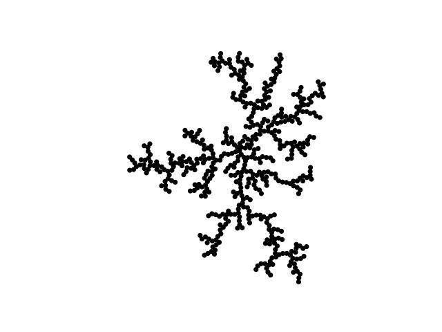
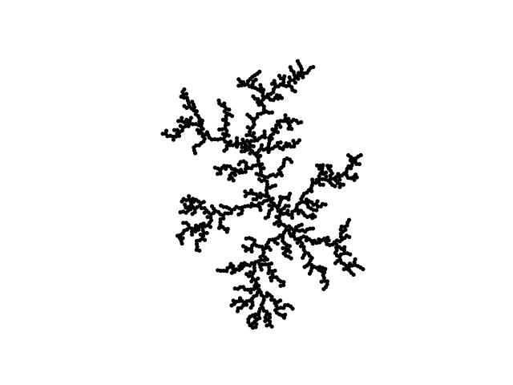
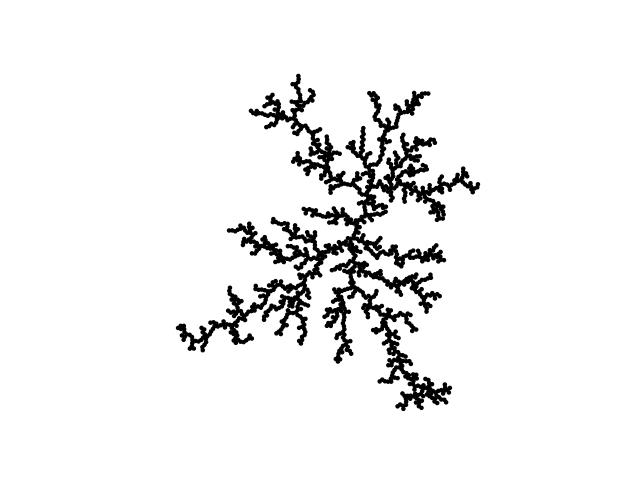

# Generowanie fraktali w 2D

Opracowany skrypt (napisany w języku Python) wyświetla wyniki dla procesu DLA w postaci ciekawych i efektownych fraktali (obiektów samopodobnych o złożonej, nietrywialnej strukturze i naturalnym wyglądzie). W tym przypadku program wyświetla drzewo (jest to tzw. drzewo Browna), na którym "liście" to cząsteczki przedstawione na ekranie w postaci kół (tu w skrypcie - o identycznym promieniu).

## Wstęp teoretyczny

Agregacja ograniczona dyfuzją (DLA) to proces w którym cząstki przechodzące tzw. błądzenie losowe w wyniku ruchu Browna skupiają się razem, tworząc agregaty. Ich połączenie, czyli wspomniane agregaty, tworzą struktury matematyczne znane jako fraktale.

Klastry utworzone w procesach DLA określane są jako drzewa Browna. Są one przykładem fraktali. Na płaszczyźnie fraktale te wykazują wymiar około 1,71 dla wolnych cząstek, które nie są ograniczone przez sieć, jednak symulacja komputerowa DLA na sieci zmienia nieznacznie wymiar fraktalny dla DLA w tym samym wymiarze osadzenia. Obserwuje się również pewne różnice w zależności od geometrii wzrostu, czy to z jednego punktu promieniowo na zewnątrz, czy na przykład z płaszczyzny lub linii.

Symulacje komputerowe procesów DLA są jednym z podstawowych sposobów badania tego modelu. Dostępnych jest kilka metod. Symulacje można przeprowadzić na sieci o dowolnej pożądanej geometrii wymiaru osadzenia lub symulację można przeprowadzić bardziej na wzór standardowej symulacji dynamiki molekularnej, w której cząsteczka może dokonać swobodnego losowego spaceru, aż znajdzie się w pewnym krytycznym zakresie, po czym zostanie przyciągnięta do klastra. Kluczowe znaczenie ma to, że liczba cząstek przechodzących ruchy Browna w układzie jest utrzymywana na bardzo niskim poziomie, tak że obecna jest tylko dyfuzyjna natura układu.

## Opis skryptu

Program generuje agregację powstałe na bazie n cząstek w procesie DLA. Wszystkie mają ten sam promień (jego wielkość określa jeden z parametrów programu).

Działanie programu rozpoczyna się od umieszczenia w pustej przestrzeni jednej cząsteczki w dowolnym miejscu. Następnie dodawana jest druga cząstka w nieskończonej odległości od pierwszej. Cząstka ta porusza się ruchem chaotycznym w pustej przestrzeni do momentu kolizji z pierwszą, wcześniej umieszczoną, pierwszą cząstką. W wyniku zderzenia obie cząstki łączą się i ich pozycja pozostaje dalej niezmienna. Następnie trzecia cząstka zostaje wprowadzona do przestrzeni i cała procedura się powtarza. Cały proces powtarzany jest iteracyjnie do momentu ustalenia się końcowej pozycji wszystkich n cząstek wziętych pod uwagę w symulacji. Finalny efekt – otrzymany fraktal - wizualizowany jest w programie za pomocą wykresu (biblioteka Matplotlib). Otrzymane fraktale dla n równego 500, 1000 i 1500 cząstek załączono na poprzedniej stronie. \*\*

Algorytm w dużej mierze czerpie z **[pracy Bragi i Ribeiro](https://www.sciencedirect.com/science/article/abs/pii/S0010465511001238?via%3Dihub)**, aby skorygować lokalizację cząstek po dotknięciu.

## Przykłady otrzymanych fraktali

n=500

n=1000

n=1400

## Wykorzystane biblioteki

Program wykorzystuje dobrze znane w ekosystemie Pythona biblioteki do zastosowań inżynierskich i naukowych, jak **SciPy** (głównie obliczenia symboliczne) i **NumPy** (przede wszystkim obliczenia numeryczne), a także bibliotekę do wykreślania wszelkiego typu wykresów i grafów – **Matplotlib**. Te trzy biblioteki wykorzystywane są bardzo często razem uzupełniając się nawzajem. Każda z nich świetnie współpracuje z pozostałymi, dzięki możliwości łatwej i szybkiej wymiany danych pomiędzy nimi.

**Warto krótko omówić każdą z nich:**

**SciPy (Scientific Python)** to bardzo popularna, otwartoźródłowa biblioteka używana do obliczeń naukowych i inżynierskich. Pozwala przeprowadzać obliczenia, symulacje i analizy matematyczne w sposób efektywny i przyjazny dla użytkownika. SciPy jest oparta o NumPy i oferuje możliwość wizualizowania i manipulacji danych przy pomocy licznych poleceń wysokiego poziomu.

**NumPy (Numerical Python)** to kolejna świetnie znana biblioteka opensource Pythona służąca do zaawansowanych obliczeń matematycznych w oparciu o obiekty array, które są pojemnikami na dane w postaci typowych macierzy o niemal dowolnym wymiarze.

**Matplotlib** jest dobrze znaną biblioteką przeznaczoną do tworzenia wykresów. Dzięki swoim szerokim możliwościom w zakresie tworzenia grafów i wykresów Matplotlib jest dobrym wyborem do celów wizualizacji danych o różnym charakterze i różnej formie.

## Sposób uruchamiania skryptu

Aby rozpocząć pracę ze skryptem należy ściągnąć wszystkie wykorzystane w programie biblioteki. Zależności skryptu najlepiej zainstalować w izolowanym środowisku uruchomieniowym (VirtualEnv, PipEnv lub innym) korzystając z pythonowskiego narzędzia PIP (Package Installer for Python). Można do tego celu wykorzystać równie dobrze znany pakiet Anaconda (lub uproszczony i okrojony jego wariant: miniconda). Niezależnie od systemu operacyjnego i sposobu uruchamiania niezbędne są wymienione wcześniej trzy biblioteki: NumPy, SciPy oraz Matplotlib.

W praktyce wystarczy wydać dwie komendy instalujące dwie ostatnie biblioteki, bowiem ta pierwsza (NumPy) instalowana jest automatycznie z Matplotlibem, jako jego podstawowa zależność.

Ostatecznie wystarczy użyć:

`pip install scipy`
oraz:
`pip install matplotlib`

Po ściągnięciu i zainstalowaniu wszystkich zależności można przystąpić do uruchomienia skryptu. Jego uruchomienie jest proste i polega jedynie na uruchomieniu głównej funkcji fraktal2D().

Jej sygnatura wygląda następująco:

Jak widać, tylko parametr n określający liczbę cząstek jest wymagany, a pozostałe argumenty posiadają wartości domyślne i są traktowane jako opcjonalne.

Parametr r określa promień cząstki, s_len to krok wykorzystany w ruchu cząstki (zaleca się by wartość ta był równa promieniowi cząstki). Ostatni parametr plot decyduje o wyświetleniu (gdy przyjmuje wartość True) fraktalu na wykresie.

Uruchamiania skryptu z poziomu konsoli:

`python DLA.py` dla Windows

`python3 DLA.py` dla Linux / Mac OS

## Czas wykonania obliczeń

Ponieważ obliczenia – mimo wykorzystania – zaawansowanych i dopracowanych bibliotek są czasochłonne, parametr n należy dostosować z rozwagą i przygotować się na odpowiedni czas jaki komputer będzie potrzebował na obliczenia.

Ponieważ proces DLA opiera się na ruchu chaotycznym (a więc losowym, nieprzewidywalnym), również czas wykonania obliczeń – na tym samym sprzęcie - nie jest możliwy do określenia, a nawet zgrubnego oszacowania. Jak widać na podstawie danych z doświadczenia, można zaobserwować, że nie zawsze mimo większej liczby cząstek czas obliczeń wydłuża się.

Zależność czasu wykonania obliczeń od liczby cząstek w symulacji:

| Liczba cząstek n. | Czas generacji. (w sekundach) |
| ----------------- | ----------------------------- |
| 100               | 8.425905227661133             |
| 200               | 24.43956708908081             |
| 300               | 37.14332962036133             |
| 400               | 62.601662158966064            |
| 500               | 67.97490978240967             |
| 600               | 167.33183789253235            |
| 700               | 418.8439631462097             |
| 800               | 330.27203726768494            |
| 900               | 347.97805070877075            |
| 1000              | 522.4021172523499             |
| 1100              | 544.6101622581482             |
| 1200              | 1042.8008592128754            |
| 1300              | 855.552582025528              |
| 1400              | 888.8614046573639             |
